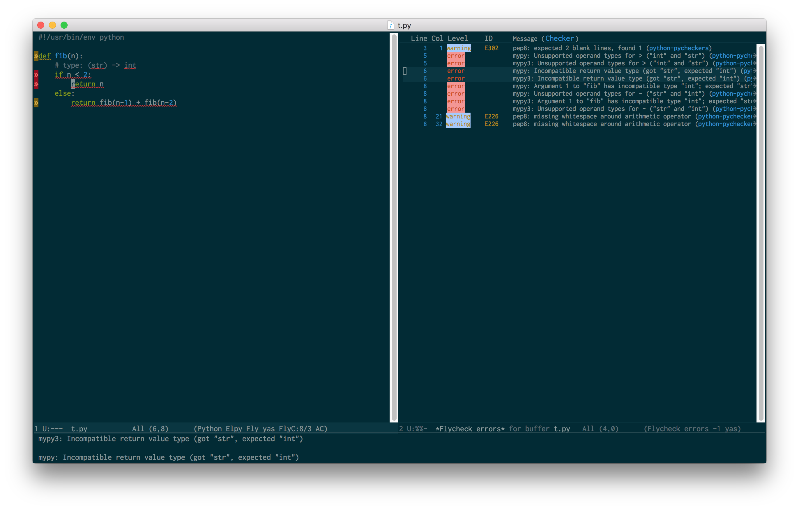

[](https://melpa.org/#/flycheck-pycheckers)
[](https://stable.melpa.org/#/flycheck-pycheckers)

# flycheck-pycheckers
Multiple syntax checker for Python


Copyright Marc Sherry <msherry@gmail.com>

## Summary

This package provides a way to run multiple syntax checkers on Python code.
The list of supported checkers includes:

- pylint
- flake8
- pep8
- pyflakes
- mypy (for both Python 2 and 3)

This is an alternative way of running multiple Python syntax checkers in Emacs
using flycheck that doesn't depend on flycheck's chaining mechanism.

flycheck is [opinionated](https://github.com/flycheck/flycheck/issues/185)
about what checkers should be run, and chaining is difficult to get right
(e.g. see https://github.com/flycheck/flycheck/issues/836).  This package
assumes that the user knows what they want, and can configure their checkers
accordingly -- if they want to run both flake8 and pylint, that's fine.

This also allows us to run multiple syntax checkers in parallel, rather than
sequentially.

## Usage

Installation via MELPA is easiest:
```elisp
M-x install-package flycheck-pycheckers
```

In your `init.el`:

```elisp
(require 'flycheck-pycheckers) ; Not necessary if installed via MELPA
(with-eval-after-load 'flycheck
   (add-hook 'flycheck-mode-hook #'flycheck-pycheckers-setup))
```

`flycheck-pycheckers` attempts to make itself the preferred Flycheck checker
for python by adding itself to the beginning of `flycheck-checkers`, which is
traversed in order until a valid checker is found. The error list (viewable with
`flycheck-list-errors`, bound to `C-c ! l` by default) shows a unified view of
all errors found by all checkers, with line and column information where
available.


